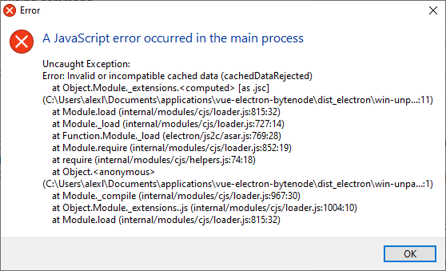

#### How to replicate the `Invalid or incompatible cached data (cachedDataRejected)` error
```
run yarn build:dir
rename dist_electron/bundled/background.js to background.src.js
copy src/background.bytenode.js to dist_electron/bundled and rename it to background.js
run electron .
delete background.src.js
run yarn run pack
open dist_electron/win-unpacked/vue-electron-bytenode.exe or dist_electron/vue-electron-bytenode Setup 0.1.0.exe
```

